# UML Class Diagram

Here is the updated UML diagram for the **Smart Meal Planner** project.

Grocery list generation is implemented as:

- **Strategy**: `GroceryListStrategy` with `MetricGroceryListStrategy` and `ImperialGroceryListStrategy`
- **Observer**: `GroceryListService` publishes updates via `PropertyChangeSupport` / `PropertyChangeListener`

```mermaid
classDiagram
    %% Abstract Factory
    class StorageFactory {
        <<abstract>>
        -static StorageFactory instance
        +static getInstance() StorageFactory
        +abstract getRecipeRepository() RecipeRepository
        +abstract getMealPlanRepository() MealPlanRepository
    }

    %% Concrete Factories
    class PostgresStorageFactory {
        +getRecipeRepository() RecipeRepository
        +getMealPlanRepository() MealPlanRepository
    }
    class H2StorageFactory {
        +getRecipeRepository() RecipeRepository
        +getMealPlanRepository() MealPlanRepository
    }

    %% Abstract Products
    class RecipeRepository {
        <<interface>>
        +save(Recipe recipe)
        +findById(long id) Optional~Recipe~
        +findAll() List~Recipe~
    }

    class MealPlanRepository {
        <<interface>>
        +save(MealPlan plan)
        +findByDate(LocalDate date) Optional~MealPlan~
        +findAll() List~MealPlan~
    }

    %% Concrete Products (H2 Family)
    class H2RecipeRepository {
        +save(Recipe recipe)
        +findById(long id) Optional~Recipe~
        +findAll() List~Recipe~
    }
    class H2MealPlanRepository {
        +save(MealPlan plan)
        +findByDate(LocalDate date) Optional~MealPlan~
        +findAll() List~MealPlan~
    }

    %% Concrete Products (Postgres Family)
    class PostgresRecipeRepository {
        +save(Recipe recipe)
        +findById(long id) Optional~Recipe~
        +findAll() List~Recipe~
    }
    class PostgresMealPlanRepository {
        +save(MealPlan plan)
        +findByDate(LocalDate date) Optional~MealPlan~
        +findAll() List~MealPlan~
    }

    %% Relationships
    StorageFactory <|-- PostgresStorageFactory : extends
    StorageFactory <|-- H2StorageFactory : extends
    
    RecipeRepository <|.. PostgresRecipeRepository : implements
    RecipeRepository <|.. H2RecipeRepository : implements
    
    MealPlanRepository <|.. PostgresMealPlanRepository : implements
    MealPlanRepository <|.. H2MealPlanRepository : implements

    %% Creation dependencies
    PostgresStorageFactory ..> PostgresRecipeRepository : creates
    PostgresStorageFactory ..> PostgresMealPlanRepository : creates
    
    H2StorageFactory ..> H2RecipeRepository : creates
    H2StorageFactory ..> H2MealPlanRepository : creates
    
    StorageFactory ..> RecipeRepository : uses
    StorageFactory ..> MealPlanRepository : uses

    %% Domain relations
    class Ingredient {
        +name
        +amount
        +unit
    }

    class Recipe {
        +id
        +title
        +description
        +tags
        +ingredients
    }
    Recipe "1" o-- "*" Ingredient

    %% Grocery list (Strategy + Observer)
    class GroceryListStrategy {
        <<interface>>
        +combine(List~Ingredient~) List~Ingredient~
    }
    class MetricGroceryListStrategy
    class ImperialGroceryListStrategy
    GroceryListStrategy <|.. MetricGroceryListStrategy : implements
    GroceryListStrategy <|.. ImperialGroceryListStrategy : implements

    class GroceryListService {
        +setMealPlan(MealPlan)
        +setStrategy(GroceryListStrategy)
        +getGroceryList() List~GroceryItem~
        +addExtraItem(Ingredient)
        +removeExtraItem(Ingredient)
        +setBought(String, String, boolean)
        +addPropertyChangeListener(PropertyChangeListener)
        +removePropertyChangeListener(PropertyChangeListener)
    }

    class GroceryItem {
        +ingredient
        +bought
    }

    class PropertyChangeListener
    GroceryListService ..> GroceryListStrategy : uses
    GroceryListService ..> PropertyChangeListener : notifies
    GroceryListService ..> MealPlan : reads
```

